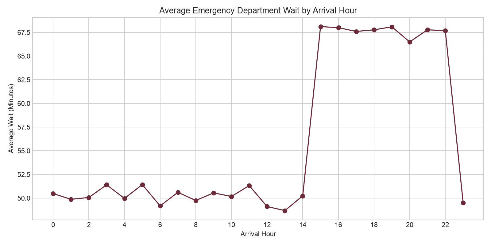
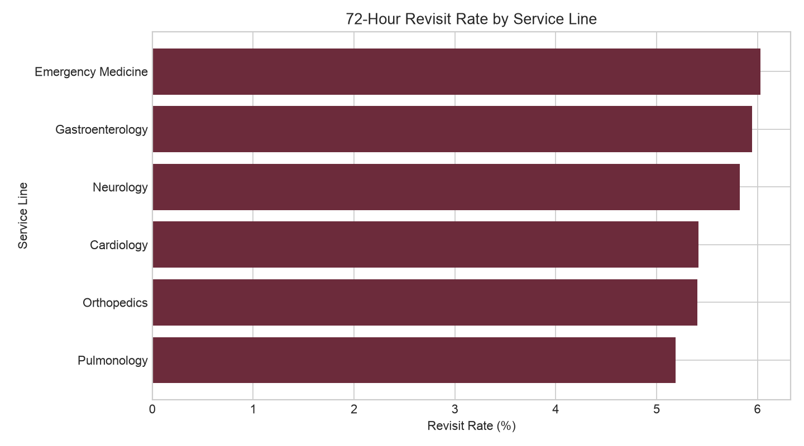

# Inland Empire Emergency Department Operations Analytics

## Project Overview

This student portfolio project analyzes synthetic emergency department data using Python, Pandas, MySQL, and Tableau. The goal is to practice a complete data analysis workflow: inspect and clean data, answer operational questions, create visualizations, and prepare a dataset for a dashboard.

The dataset is entirely synthetic and contains no real patient information. The project is not affiliated with or endorsed by Loma Linda University Health.

## Business Questions

- When are emergency department wait times highest?
- Which facilities and service lines have the longest average wait times?
- What patterns appear in 72-hour revisits?
- How does emergency department length of stay vary across the dataset?
- How do the main operational performance indicators compare by shift and facility?

## Dataset

The analysis uses 12,000 synthetic emergency department encounters from 2024. Important columns include arrival date and time, facility, service line, ESI acuity, payer, wait minutes, length of stay, disposition, 72-hour revisit status, and satisfaction score.

The main source file is [`data/processed/tableau_ed_encounters.csv`](data/processed/tableau_ed_encounters.csv). A complete field reference is available in the [data dictionary](docs/data_dictionary.md).

## Data Analysis Workflow

1. Load and inspect the data
2. Review shape, columns, data types, and descriptive statistics
3. Check duplicate rows and missing values
4. Clean and prepare the dataset
5. Perform exploratory data analysis with Python and Pandas
6. Analyze business questions using SQL
7. Create visualizations
8. Export processed data for Tableau
9. Develop the Tableau dashboard

## Python Analysis

The [`src/data_analysis.py`](src/data_analysis.py) script demonstrates fundamental data analyst skills:

- Loading CSV data with Pandas
- Using `head()`, `shape`, `columns`, `info()`, and `describe()`
- Reviewing data types, duplicates, and missing values
- Converting dates and numerical columns
- Filtering, sorting, grouping, and aggregating data
- Creating calculated columns for time periods and wait targets
- Comparing operational indicators by shift, facility, and service line
- Creating labeled charts with Matplotlib
- Exporting cleaned data and summary tables

## SQL Analysis

The [`sql/analysis_queries.sql`](sql/analysis_queries.sql) file moves from basic queries to practical intermediate analysis. It includes `SELECT`, `WHERE`, `ORDER BY`, `GROUP BY`, `COUNT`, `AVG`, `MIN`, `MAX`, `SUM`, `CASE`, `JOIN`, `HAVING`, a subquery, and a common table expression.

The queries answer questions about long waits, overall performance indicators, facility comparisons, wait categories, service-line revisits, and shift-level wait times.

## Key Findings

- The 12,000 synthetic encounters had an average wait of **56.0 minutes**.
- The median emergency department length of stay was **214 minutes**.
- Evening-shift encounters had the highest average wait at **67.7 minutes**, compared with about **50 minutes** during day and night shifts.
- The overall synthetic 72-hour revisit rate was **5.7%**.
- Average facility wait times were similar, ranging from **55.2 to 56.1 minutes**.

These findings describe patterns in the synthetic dataset and are not clinical conclusions.

## Visualizations

### Average wait by arrival hour



The chart shows a clear increase in average wait times for arrivals during the evening hours.

### 72-hour revisit rate by service line



The chart compares revisit percentages across service lines and highlights where additional review may be useful.

## Tableau Dashboard — In Progress

The cleaned dataset is prepared for Tableau, but a completed Tableau workbook or published dashboard is not currently included. The planned dashboard will contain four KPI cards, an hourly wait-time trend, facility and service-line comparisons, and a small set of filters.

See the [Tableau dashboard guide](tableau/dashboard_guide.md) for the proposed layout and calculated fields.

## Repository Structure

```text
healthcare-operations-analytics/
├── data/
│   └── processed/
├── docs/
│   └── data_dictionary.md
├── reports/
│   └── figures/
├── sql/
│   └── analysis_queries.sql
├── src/
│   └── data_analysis.py
├── tableau/
│   └── dashboard_guide.md
├── LICENSE
├── README.md
└── requirements.txt
```

## Tools Used

- Python
- Pandas
- MySQL
- Tableau

The Python script analyzes the dataset, displays the results, creates the visualizations, and exports processed CSV files for further analysis and Tableau.

## Author

Michael Chavez

Data Analytics Student
